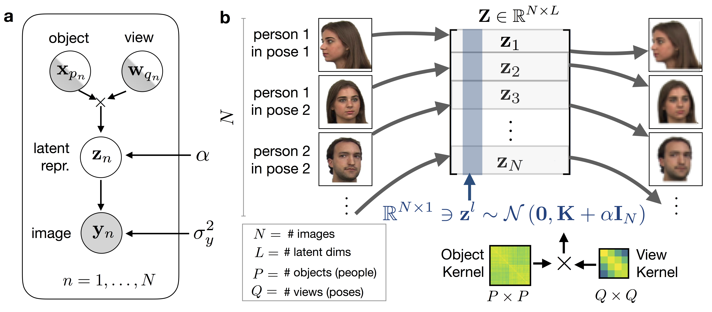

# GPPVAE

Code accompanying the paper [Gaussian Process Prior Variational Autoencoder](https://arxiv.org/abs/1810.11738) [1].

<p align="center">
  
</p>

[1] Casale FP, Dalca AV, Saglietti L, Listgarten J, Fusi N. Gaussian Process Prior Variational Autoencoders, 32nd Conference on Neural Information Processing Systems, 2018, Montreal, Canada.


## Install dependencies

The dependencies can be installed using [anaconda](https://www.anaconda.com/download/):

```bash
conda create -n gppvae python=3.6
source activate gppvae
conda install -y numpy scipy h5py matplotlib dask pandas
conda install -y pytorch=0.4.1 -c soumit
conda install -y torchvision=0.2.1
```

## Downloading and formatting the data

After cloning this respository:

```bash
cd GPPVAE/pysrc/faceplace
python get_data.py
```

## Run VAE

Plots and weights are dumped in the specified output dir every pre-determined number of epochs, which can be specified using the argument ``epoch_cb``.

```bash
python train_vae.py --outdir ./out/vae
```

## Run GPPVAE

For optimal performance, the autoencoder parameters of the GPPVAE model should be initialized to those of a pretrained VAE (see above). 
This can be done reusing the output of the run vae command.
For example, if the vae results are contained in ./out/vae and one has trained VAE for 5000 epochs, then one can use:

```bash
python train_gppvae.py --outdir ./out/gppvae --vae_cfg ./out/vae/vae.cfg.p --vae_weights ./out/vae/weights.04999.pt
```

## Problems

If you encounter any issue, please, [report it](https://github.com/limix/limix-core/issues/new).

## License

This project is licensed under the Apache License (Version 2.0, January 2004) -
see the [LICENSE](LICENSE) file for details

## Citation

If you use any part of this code in your research, please cite our [paper](https://arxiv.org/abs/1810.11738):

```
@article{casale2018gaussian,
  title={Gaussian Process Prior Variational Autoencoders},
  author={Casale, Francesco Paolo and Dalca, Adrian V and Saglietti, Luca and Listgarten, Jennifer and Fusi, Nicolo},
  journal={arXiv preprint arXiv:1810.11738},
  year={2018}
}
```
